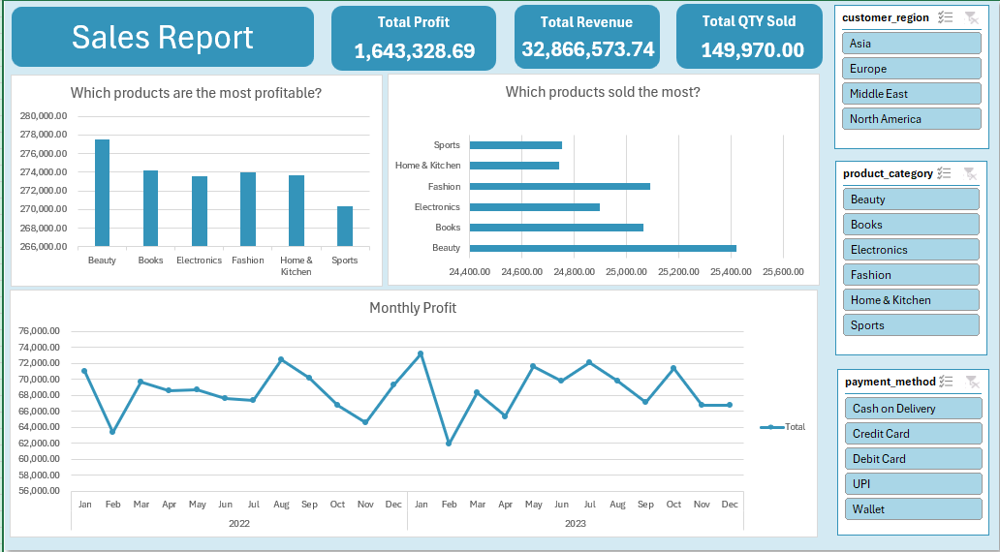

### About Dataset
- This dataset provides a cleaned and structured look at Amazon sales performance

| Column | Description |
|--------|-------------|
| `order_id` | Unique order identifier |
| `order_date` | Date of purchase |
| `product_id` | Product identifier |
| `product_category` | Product category (Books, Fashion, Sports, Electronics, Beauty, Home & Kitchen, etc.) |
| `price` | Original selling price |
| `discount_percent` | Discount applied (%) |
| `quantity_sold` | Number of units sold |
| `customer_region` | Customer's region (Asia, Europe, North America, Middle East, etc.) |
| `payment_method` | Payment type (UPI, Credit Card, Debit Card, Wallet, Cash on Delivery) |
| `rating` | Customer rating |
| `review_count` | Number of reviews |
| `discounted_price` | Selling price after discount |
| `total_revenue` | Revenue generated by the order |
| `profit` | Profit earned from the order |

### dashboards

### Insites
