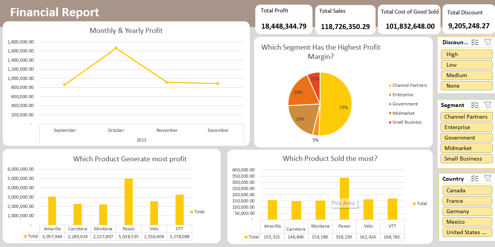

### About Dataset

-  A dataset consisting of sales and profit data sorted by market segment and country/region.

- The raw data includes formatting inconsistencies, such as:
    - currency  '$' sign and '-' from all columns where they are present
    - incorrect data types or formatting 
    - comma separators in numeric fields

## DaShboard

### Insites

## Sales & Discount Analysis Report
## Executive Summary
- Paseo is the top-performing product across sales, units sold, and profit.
- The Government segment generates the highest volume and profit.
- The United States leads in total sales, while France leads in profit.
- Increasing discounts does not always improve performance. In many cases, it increases volume but reduces profit.

## Product Performance
- Paseo dominates overall performance and is the main revenue driver.
- VTT and Amarilla follow but show more sensitivity to discount changes.
- Some products perform better without heavy discounting, suggesting strong base demand.

## Segment Insights
- Government is the most valuable segment in terms of both units sold and profit.
- Small Business and Channel Partners contribute moderately but are less profitable.

## Insight: Focus on retaining and expanding the Government segment since it brings the highest returns.

## Country Performance

- By Profit:

1. France
2. Germany
3. Canada
4. United States
5. Mexico

- By Sales:

1. United States
2. Canada
3. France
4. Germany
5. Mexico

## Insight: The United States drives volume (sales), but France is more profitable. This may indicate higher costs or heavier discounting in the U.S.

## Discount Band Analysis 
## Overall Pattern
- Higher discounts generally:
    - Increase units sold
    - Reduce profit
    - Best results are often found at low or medium discount levels, not high.

## Product-Level Insights

- Paseo
    - Higher discounts increase units sold
    - But reduce sales value and profit
    - Discounting hurts profitability

- Velo
    - Sales increase with higher discounts
    - Profit decreases as discounts increase
    - Volume growth comes at the cost of margin

- VTT
    - Best sales occur at low discount
    - Medium discount reduces performance
    - High discount slightly recovers but not fully
    - Low discount is the most effective strategy

- Amarilla
    - Medium discount gives the highest profit and sales
    - High discount increases sales but lowers profit
    - Medium discount is optimal

- Carretera
    - Higher discounts increase sales and units
    - Profit is highest at low discount
    - Avoid heavy discounting

- Montana
    - Performance improves from no discount to medium
    - Drops again at high discount
    -  Medium discount is the sweet spot

## Key Business Insights 
- Heavy discounting is not a reliable strategy for increasing profit.
- There is a clear trade-off between volume and profitability.
- Many products perform best at low to medium discount levels.

## Recommendations
- Reduce reliance on high discounting, especially for strong products like Paseo
- Focus on optimal pricing (low–medium discount range)
- Prioritize high-value segments like Government
- Investigate why high-sales regions (like the U.S.) are less profitable

